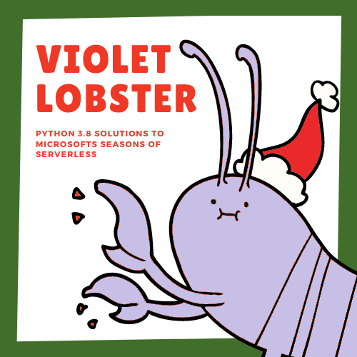
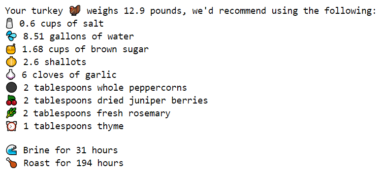
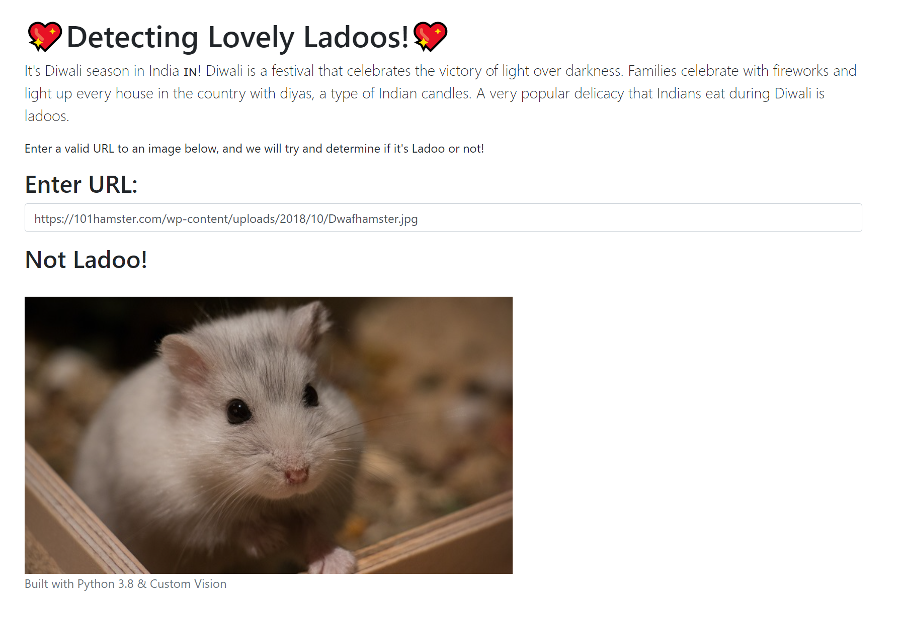

[](https://opensource.org/licenses/MIT)
<br />
<p align="center">
  <a href="https://github.com/errbufferoverfl/violet-lobster">
    
  </a>

<h3 align="center">Violet Lobster</h3>

  <p align="center">
    Solutions to Microsoft's 2020 Seasons of Serverless challenges.
    <br />
    <a href="https://github.com/microsoft/Seasons-of-Serverless"><strong>Explore the docs »</strong></a>
    <br />
  </p>
</p>

## Tabel of Contents
<!-- TABLE OF CONTENTS -->

* [About the Project](#about-the-project)
  * [Solutions](#solutions)
  * [Built With](#built-with)
* [Getting Started](#getting-started)
  * [Prerequisites](#prerequisites)
  * [Installation](#installation)
* [Usage](#usage)

## About the Project
<!-- ABOUT THE PROJECT -->

These are my soltutions to Microsoft's 2020 Seasons of Serverless challenges, each week I will attempt to write a solution using Python 3.8 and deploy it to Azure Functions. Each solution will be listed below, along with a screen capture.

### Solutions
<!-- SOLUTIONS -->

| Week | Challenge | Solution | Screen Capture | README |
|------|-----------|----------|----------------|--------|
| 1    | [The Perfect Holiday Turkey 🦃](https://github.com/microsoft/Seasons-of-Serverless/blob/main/Nov-23-2020.md) | [Github Solution](https://github.com/errbufferoverfl/violet-lobster/tree/main/week-01) |  | [README](https://github.com/errbufferoverfl/violet-lobster/blob/main/week-01/README.md) |
| 2    | [Lovely Ladoos 💞](https://github.com/microsoft/Seasons-of-Serverless/blob/main/Nov-30-2020.md) | [Detecting Lovely Ladoos Demo](https://stglovelyladoostest.z8.web.core.windows.net/) |  | [README](https://github.com/errbufferoverfl/violet-lobster/blob/main/week-02/README.md) |


### Built With
<!-- BUILT WITH -->

* Azure Functions
* Azure Custom Vision
* Python 3.8

## Getting Started
<!-- GETTING STARTED -->

### Prerequisites
<!-- PREREQUISITES -->

* Microsoft Azure Account
* Python 3.8
* Each project comes with a `requirements.txt` that needs to be installed as part of deploying to Azure Functions.

### Installation
<!-- INSTALLATION -->

1. Clone the violet-lobster
```sh
git clone https://github.com/errbufferoverfl/violet-lobster.git
```
2. Create a virtual environment
```sh
cd violet-lobster/week-xx
python -m venv venv
source venv/bin/activate
```
3. Install the dependencies
```sh
pip install -r requirements.txt
```
4. Run the function locally
```sh
func start
```

## Usage
<!-- USAGE -->

Usage instructions can be found in each challenges directory.
